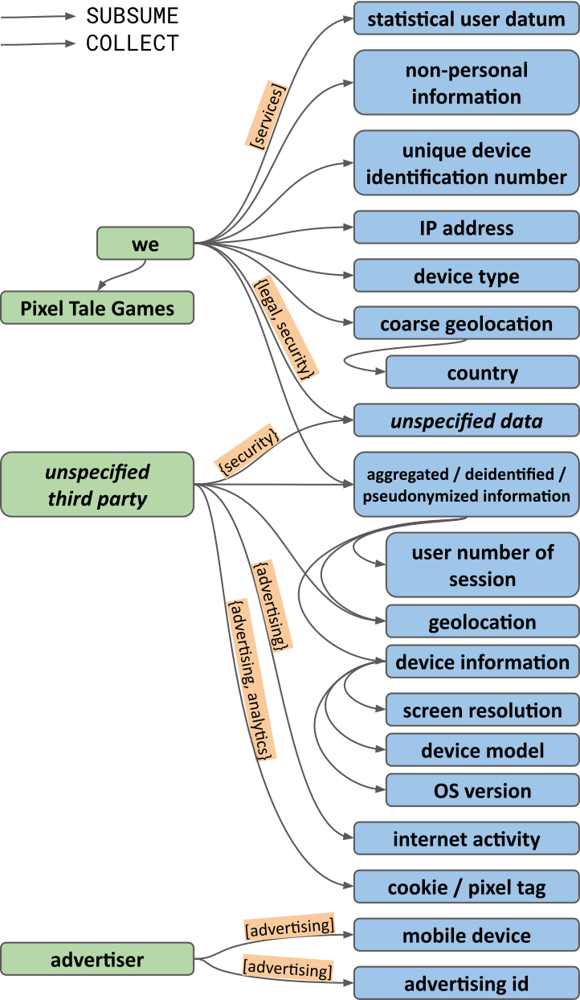

# USENIX Security 2023 Artifact Evaluation

This document provides instructions on how to reproduce the main results in our paper in support of the USENIX Security 2023 Artifact Evaluation.

Please note the exact commands shown in this document are intended for artifact reviewers, who have been given access to a preconfigured environment. For other users, please check [README.md](../README.md) at the top level of this repository for general information about the use of our code.

## Overall Instruction

For artifact reviewers, we provide access to our test server which has the recommended hardware configuration. Please check the "Artifact access" information on HotCRP for instructions on how to access the server via SSH.

We have prepared the following directories in the home directory:

- `~/poligraph`: This directory contains our [Git repository](https://github.com/UCI-Networking-Group/PoliGraph), which includes all the code needed for artifact evaluation.
- `~/dataset`: This directory contains the benchmark dataset and all the external data required for the artifact evaluation. We suggest performing all the experiments in this directory.
- `~/dataset-clean`: This directory copies the initial state of `~/dataset`. If anything goes wrong and you want to restart from scratch, you can delete `~/dataset` and copy this directory to create a new `~/dataset` directory.
- `~/dataset-finished`: This directory reflects the state of `~/dataset` after running all the experiments. You can compare your results to the ones here.

In this document, we provide a step-by-step instruction for artifact evaluation on our test server.

We have included each command line and the expected output in code blocks like this:

```
$ python example.py
Dummy result 1: 123456
Dummy result 2: 123456
```

In this case, the command (after the prompt `$`) to execute is `python example.py`, and the last two lines indicate the expected output.

## Installation

We have set up the software environment on our test server. Please skip this step.

For other users, we provide installation instructions in the [README.md](../README.md) at the top level of this repository.

## Basic Test

Here, we illustrate how to generate a PoliGraph from [a real privacy policy](https://web.archive.org/web/20230330161225id_/https://proteygames.github.io/).

Change to the `~/dataset` directory before proceeding:

```
$ cd ~/dataset
```

Step 1. Run the HTML crawler to download the privacy policy webpage:

```
$ python -m poligrapher.scripts.html_crawler https://web.archive.org/web/20230330161225id_/https://proteygames.github.io/ example/
2023-06-17 12:45:42,703 [INFO] Testing URL 'https://web.archive.org/web/20230330161225id_/https://proteygames.github.io/' with HEAD request
2023-06-17 12:45:45,127 [INFO] Navigating to 'https://web.archive.org/web/20230330161225id_/https://proteygames.github.io/'
2023-06-17 12:45:46,497 [INFO] Saved to example
```

The `example/` directory will be used to store all the intermediate and final output associated with this privacy policy.

Step 2. Run the NLP pipeline on the privacy policy text:

```
$ python -m poligrapher.scripts.init_document example/
2023-06-17 12:47:18,404 [INFO] Processing example/ ...
2023-06-17 12:47:18,586 [INFO] New segment: Segment #0, type=TEXT, Parent: None
<more output omitted>
2023-06-17 12:47:18,790 [INFO] New segment: Segment #48, type=TEXT, Parent: Segment #46, type=HEADING
```

Step 3. Run the annotators:

```
$ python -m poligrapher.scripts.run_annotators example/
2023-06-17 12:48:39,696 [INFO] <root> Processing example/ ...
<more output omitted>
2023-06-17 12:48:39,998 [INFO] <ListAnnotator> Edge SUBSUM: the following links -> App Store
```

Step 4. Build the PoliGraph:

```
$ python -m poligrapher.scripts.build_graph --pretty example/
2023-06-17 12:50:17,157 [INFO] Processing example/ ...
2023-06-17 12:50:17,742 [INFO] Purpose 'to show advertising that they consider relevant to you' -> ['advertising']
<more output omitted>
2023-06-17 12:50:17,794 [INFO] Nodes to remove: Facebook, Google, Twitter, VK, external link, in app advertisement
```

The generated PoliGraph can be found in `example/graph-original.yml` and `example/graph-original.graphml`. A text editor (e.g., vim) can be used to view `example/graph-original.yml`. For more instructions, refer to the page [Viewing a PoliGraph](./view-poligraph.md).

The PoliGraph generated here should be identical to:



This is the same example used in Figure 5 in our paper, and Figure 10 in [our extended paper](https://arxiv.org/abs/2210.06746).

## Experiments

### E0: PoliGraph Generation

The `dedup/` directory contains 6,084 unique privacy policies from the PoliCheck project, serving as our benchmark dataset. Please complete E0 before the subsequent experiments, as they all rely on the PoliGraphs generated here.

Change to the `~/dataset` directory before proceeding:

```
$ cd ~/dataset
```

We apply Steps 2-4 from the Basic Test on all the privacy policies. Given the lengthy processing time for all privacy policies, we suggest using a terminal multiplexer like `screen` or `tmux` to keep commands running.

Step 1. Run the NLP pipeline (`init_document`):

```
$ python -m poligrapher.scripts.init_document dedup/*
2023-06-17 15:46:47,781 [INFO] Processing dedup/0003137f872072c4e797e5a6dd82864b20845fe559b37b756478c058e9c9c7ec ...
<more output omitted>
2023-06-17 18:20:08,334 [INFO] New segment: Segment #61, type=TEXT, Parent: Segment #55, type=HEADING
```

This step takes approximately 2.5 hours to complete.

Step 2. Run the annotators (`run_annotators`):

```
$ python -m poligrapher.scripts.run_annotators dedup/*
2023-06-17 19:58:12,183 [INFO] <root> Processing dedup/0003137f872072c4e797e5a6dd82864b20845fe559b37b756478c058e9c9c7ec ...
<more output omitted>
2023-06-17 20:39:29,023 [INFO] <PurposeAnnotator> Linkable data types: [data]
```

This step takes approximately 40 minutes to complete.

Step 3. Build PoliGraphs (`build_graph`):

```
$ python -m poligrapher.scripts.build_graph dedup/*
2023-06-17 20:40:21,022 [INFO] Processing dedup/0003137f872072c4e797e5a6dd82864b20845fe559b37b756478c058e9c9c7ec ...
<more output omitted>
2023-06-17 20:55:52,285 [INFO] Nodes to remove: Google, VK, Yandex ...
```

This step takes approximately 15 minutes to complete.

#### Results

After completing these steps, you will find a `graph-original.yml` file, containing the generated PoliGraph, in each subdirectory:

```
$ ls dedup/*/graph-original.yml | wc -l
6084
```

Additionally, you may choose some PoliGraphs [to view](./view-poligraph.md), or to compare with our results in the `~/dataset-finished` directory:

```
$ diff dedup/0003137f872072c4e797e5a6dd82864b20845fe559b37b756478c058e9c9c7ec/graph-original.yml ~/dataset-finished/dedup/0003137f872072c4e797e5a6dd82864b20845fe559b37b756478c058e9c9c7ec/graph-original.yml
<No output, indicating the two files are identical>
```

### E1: Comparison to Prior Policy Analyzers

In this experiment, we reproduce the evaluation in Section 4.2 of the main paper. We compare collection relations inferred by PoliGraph with:
- Manually labeled ground truth located at `~/dataset/external/manual-collection-relations.csv`.
- Collection statements or tuples extracted by PolicyLint, located at `~/dataset/external/policylint-ext`.

This experiment takes less than 10 minutes to complete.

Change to the `~/dataset` directory before proceeding:

```
$ cd ~/dataset
```

Step 1. The scripts needed for this experiment are in the `evals/tuples/` directory in the Git repo. Copy them to the current directory for convenience:

```
$ cp -Tr ~/poligraph/evals/tuples eval-tuples
```

Step 2. Convert collection relations inferred through PoliGraph into tuples in a CSV file:

```
$ python eval-tuples/export_poligraph_tuples.py -o eval-tuples/result-poligraph.csv s_test/*
2023-06-17 21:02:18,892 [INFO] Processing s_test 0003137f872072c4e797e5a6dd82864b20845fe559b37b756478c058e9c9c7ec ...
<more output omitted>
2023-06-17 21:02:20,123 [INFO] Processing s_test/fe18540d552a0e9405db3af93d485b654bbf2c8847baa440a201a3a5d6f032cb ...
```

The contents in `s_test/` link to a subset of 200 privacy policies in `dedup/`, which we use as the test set.

Step 3. Convert PolicyLint tuples that belong to the same set of privacy policies into a CSV file:

```
$ python eval-tuples/export_policylint_tuples.py -e external/policylint-ext -o eval-tuples/result-policylint.csv s_test/*
2023-06-17 21:03:06,187 [INFO] Processing s_test/0003137f872072c4e797e5a6dd82864b20845fe559b37b756478c058e9c9c7ec ...
<more output omitted>
2023-06-17 21:03:07,580 [INFO] Processing s_test/fe18540d552a0e9405db3af93d485b654bbf2c8847baa440a201a3a5d6f032cb ...
```

Step 4. Compare CSV files from both sides to the ground truth:

```
$ python eval-tuples/evaluate.py external/manual-collection-relations.csv eval-tuples/result-poligraph.csv
# tuples: 640
('we', '3rd-party')
precision = 96.9%
   recall = 70.6%
('we',)
precision = 99.8%
   recall = 64.0%
('3rd-party',)
precision = 91.9%
   recall = 87.5%
```

```
$ python eval-tuples/evaluate.py external/manual-collection-relations.csv eval-tuples/result-policylint.csv
# tuples: 291
('we', '3rd-party')
precision = 91.8%
   recall = 30.4%
('we',)
precision = 93.0%
   recall = 37.9%
('3rd-party',)
precision = 82.4%
   recall = 11.3%
```

#### Results

- The output in Step 4 corresponds to the precisions and recalls reported in Table 4 ("PoliGraph-er" and "PolicyLint" rows) of our main paper.
- Additionally, you may open `eval-tuples/result-poligraph.csv` and `eval-tuples/result-policylint.csv` to view tuples inferred through PoliGraph and those found by PolicyLint.

### E2: Policies Summarization

In this experiment, we reproduce main results about policies summarization presented in Section 5.1 of the main paper. We use PoliGraph to summarize a large corpus of privacy policies and reveal common patterns among them.

This experiment takes less than 10 minutes to complete.

Change to the `~/dataset` directory before proceeding:

```
$ cd ~/dataset
```

Step 1. The scripts needed for this experiment are in the `analyses/summarization` directory in the Git repo. Copy them to the current directory for convenience:

```
$ cp -Tr ~/poligraph/analyses/summarization summarization
```

Step 2. Run `collect-and-purpose-statistics.py` to generate statistics over the entire dataset:

```
$ python summarization/collect-and-purpose-statistics.py -o summarization/ dedup/*
# of policies that disclose the collection of known categories: 4093
# of policies that disclose to share categories other than software identifiers: 620
# of policies that disclose non-core usage purposes: 2990
# of policies that disclose advertising purpose: 2398
```

Apart from the output, the script also produces several CSV files in `summarization/` for figure creation.

Step 3. Generate figures of policies summarization results:

```
$ python summarization/plot.py summarization/ summarization/figure.pdf
```

#### Results

- In Step 2, the printed statistics are reported in Section 5.1 of the main paper.
- The PDF file `summarization/figure.pdf` from Step 3 should reproduce Figures 8(a), 8(b), and 8(c) in the main paper.

### E3: Correct Definitions of Terms

In this experiment, we use PoliGraph to assess the correctness of definitions of terms, as presented in Section 5.2 of the main paper.

This experiment takes less than 10 minutes to complete.

Change to the `~/dataset` directory before proceeding:

```
$ cd ~/dataset
```

Step 1. The scripts needed for this experiment are in the `analyses/term-definitions` directory in the Git repo. Copy them to the current directory for convenience:

```
$ cp -Tr ~/poligraph/analyses/term-definitions term-definitions
```

Step 2. Run `check-misleading-definition.py` to find term definitions that do not align with our global ontologies:

```
$ python term-definitions/check-misleading-definition.py dedup/*
Processing dedup/0003137f872072c4e797e5a6dd82864b20845fe559b37b756478c058e9c9c7ec ...
<more output omitted>
Processing dedup/fff5cc1d040c88267a1227a48f6506841331813a2f2468b6ec0cabe0b1e85581 ...
```

This step will create a `misleading_definitions.csv` file in each privacy policy's subdirectory that contains all the different definitions. For example:

```
$ cat dedup/f98d62977bb0ac2e5ebe3252295b577be43a35815482bd1c07334f76c064a3b2/misleading_definitions.csv
type,parent,child
data,non-personal information,device information
data,non-personal information,ip address
```

Step 3. Run `check-self-defined-terms.py` to aggregate non-standard terms found in privacy policies into a CSV file:

```
$ python term-definitions/check-self-defined-terms.py -o term-definitions/non-standard-terms.csv dedup/*
Processing dedup/0003137f872072c4e797e5a6dd82864b20845fe559b37b756478c058e9c9c7ec ...
<more output omitted>
Processing dedup/fff5cc1d040c88267a1227a48f6506841331813a2f2468b6ec0cabe0b1e85581 ...
```

#### Results

To reproduce results in Table 5 in our main paper, we use `xsv`, a command-line CSV parser, to obtain statistics from all `misleading_definitions.csv` files. For example, the following command line obtains the most common data types defined as "non-personal information":

```
$ xsv cat rows dedup/*/misleading_definitions.csv | xsv search -s parent '^non-personal information$' | xsv frequency -s child
field,value,count
child,ip address,126
child,geolocation,123
child,device identifier,108
child,gender,76
child,package dump,72
child,age,70
child,identifier,46
child,internet activity,44
child,device information,38
child,coarse geolocation,35
```

Results in Table 6 can be found in the `term-definitions/non-standard-terms.csv` file generated from Step 3:

```
$ xsv search -s term '^technical information$' term-definitions/non-standard-terms.csv
type,term,def_count,use_count,possible_meanings
DATA,technical information,126,311,advertising id|age|aggregate / deidentified / pseudonymized information|android id|anonymous identifier|browsing / search history|contact information|cookie / pixel tag|credit / debit card number|device identifier|device information|email address|geolocation|identifier|imei|internet activity|ip address|mac address|person name|personal identifier|personal information|phone number|postal address|precise geolocation|serial number|ssn
```

The row indicates that the data type "technical information" is defined in 126 and used in 311 privacy policies, and possible specific data types are listed in the last column.

## Additional Experiments

Corresponding to our USENIX '23 Artifact Appendix, this document covers experiments in Sections 4.2 (Evaluation), 5.1 (Policies Summarization), and 5.2 (Correct Definitions of Terms), which we believe showcase the main merits of PoliGraph. For those interested in Sections 5.3 (Contradiction Analysis) and 5.4 (Data Flow-to-Policy Consistency Analysis), we provide another document [Artifact Evaluation (Additional Experiments)](./usenix-artifact-evaluation-additional.md) to show how to reproduce the main results there.
