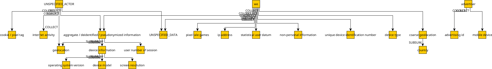

# Viewing a PoliGraph

This document explains how to view a PoliGraph generated by PoliGraph-er.

Please note that PoliGraph is designed for automated analysis. A PoliGraph may contain hundreds of nodes and edges, which makes it less human-readable. We visualize PoliGraph mainly for debugging purposes.

## Viewing the YAML File

You can use a text editor (e.g., vim) to view `example/graph-original.yml`. The content is in [YAML format](https://yaml.org/spec/1.2.2/) and represents the graph in the [node-link format](https://networkx.org/documentation/stable/reference/readwrite/generated/networkx.readwrite.json_graph.node_link_data.html) of NetworkX.

The format is human-readable and fairly straightforward. For example, the object below indicates a COLLECT edge from "we" to "statistical user datum" with a purpose "services" as the attribute:

```yaml
- source: we
  target: statistical user datum
  key: COLLECT
  text: ...
  purposes:
    services: ...
```

## Using yEd to display the GraphML file

Alternatively, if you supply the `--pretty` argument to the `poligrapher.scripts.build_graph` script, it will generate a PoliGraph in [GraphML format](https://en.wikipedia.org/wiki/GraphML), which is recognized by GUI graph editors like yEd.

To use yEd to visualize the GraphML file, follow the instructions on the [yEd website](https://www.yworks.com/products/yed/download) to install the software on your local machine.

If applicable, copy the GraphML file of PoliGraph from the server to your machine:

```
$ scp <server_addr>:example/graph-original.graphml ./
```

Open yEd, and use it to open `graph-original.graphml`.

Go to the menu `Edit -> Properties Mapper`, use the `+` button to add a `New Configuration for Nodes`, with the following mapping:

| Data Source | Map To     | Conversion |
|-------------|------------|------------|
| label       | Label Text | Automatic  |

Click the `Apply` button to apply the mapping.

Use the `+` button to add a `New Configuration for Edges`, with the following mapping:

| Data Source  | Map To     | Conversion |
|--------------|------------|------------|
| relationship | Label Text | Automatic  |

Click the `Apply` button to apply the mapping.

Then, close the window, go to the menu `Layout -> Hierarchical`, and click `OK` to auto-layout nodes. You should achieve a more organized layout like this:



Please note that yEd cannot display purpose attributes on COLLECT edges.
